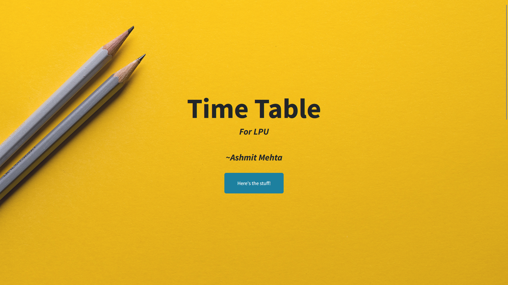
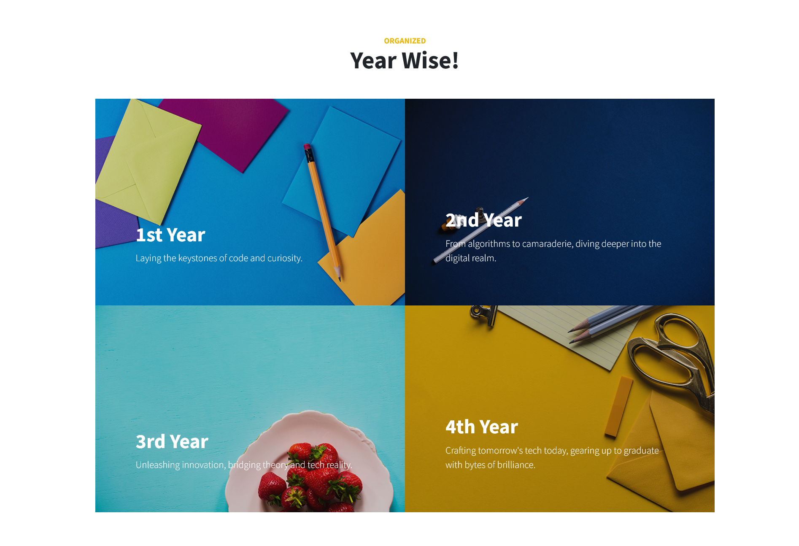
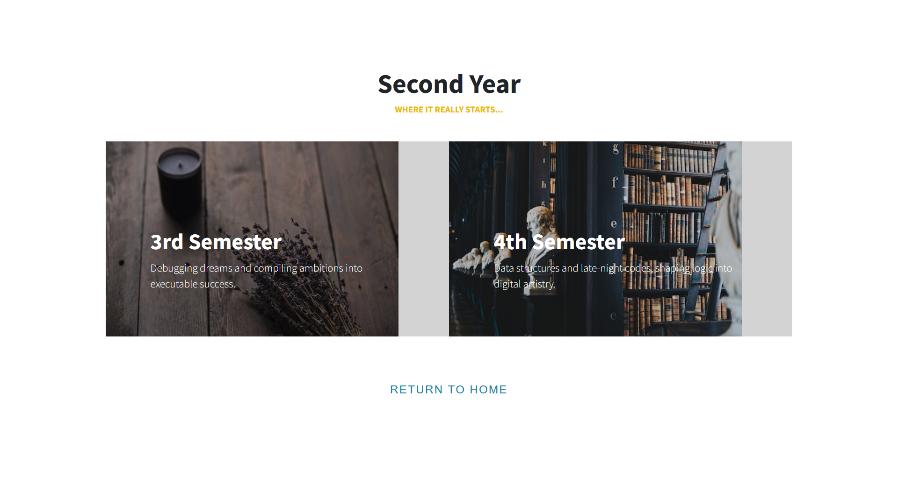
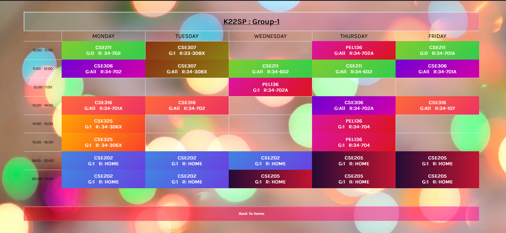

# Timetable for LPU (<i>My sections only</i>)

This repository contains the timetables for all the semesters I have cleared or am currently in. You can conveniently access these timetables directly on the website [lpu.web.app](https://lpu.web.app). This repository is aimed at helping me stay organized and manage my academic schedules effectively.

## Table of Contents

- [Introduction](#introduction)
- [Accessing Timetable](#accessing-timetable)
- [Preview](#preview)
- [Contributing](#contributing)
- [Feedback](#feedback)
- [License](#license)

## Introduction

As a student at Lovely Professional University (LPU), managing my schedule can be challenging, especially when you're juggling multiple courses and activities. This repository aims to simplify the process by providing with easy access to your timetable.

## Accessing Timetable

WE can access the timetables directly on the website [lpu.web.app](https://lpu.web.app). The website is designed to be user-friendly and provides a seamless experience for viewing the timetables. Simply follow these steps:

1. **Visit the Website**: Open your web browser and go to [lpu.web.app](https://lpu.web.app).

2. **Select the Semester**: On the website's homepage, you'll find a list of semesters I have cleared or am currently enrolled in. Click on the semester you want to view the timetable for.

3. **View Timetable**: Once you've selected a semester, the corresponding timetable will be displayed. You can see the schedule for each day of the week, including class timings, subjects, and Room numbers.

## Preview

Here are some screenshots of the [lpu.web.app](https://lpu.web.app) website:

*Homepage - Easily choose the year you want to view.*

*Semester - Easily choose the semester you want to view.*

*Group - Easily choose the Group you want to view.*

*Timetable - Clear visualization of the class schedule for the selected semester.*

## Contributing

This repository is currently maintained by me. However, if you would like to contribute to improve the user experience, add features, or fix issues, you are welcome to do so. Here's how you can contribute:

1. Fork the repository to your own GitHub account.

2. Create a new branch from the `main` branch for your changes.

3. Make your desired changes, whether they involve design improvements, code enhancements, or bug fixes.

4. Commit your changes and push them to your forked repository.

5. Open a pull request (PR) from your branch to the `main` branch of this repository. Provide a clear description of the changes you've made.

6. Your PR will be reviewed, and once approved, your changes will be merged into the main repository.

## Feedback

Your feedback is highly valuable for improving this repository and the associated website. If you encounter any issues, have suggestions for improvements, or want to share your experience, please don't hesitate to [create an issue](https://github.com/Ash-codes18/Timetable_LPU/issues). Your input will help enhance the usability and effectiveness of the timetable system.

## License

This project is licensed under the [MIT License](LICENSE). You are free to use, modify, and distribute t    he code as per the terms of this license.

---

If you have any questions or need assistance, feel free to contact me.
